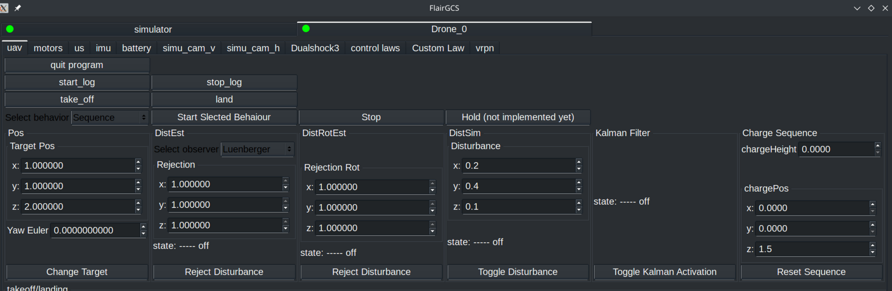

# SimpleControl

## Overview

**SimpleControl** is a control framework designed for drones, providing flexible flight mode management and disturbance observer estimation. This project integrates various control and estimation methods and is developed for use with the [FL-AIR framework](https://gitlab.utc.fr/uav-hds/flair/flair-src).


## Features

- **Multiple Flight Modes**: 
  - Position Control
  - Trajectory Control
  - Sequence Control
- **Disturbance Observer Estimation**: Supports multiple observer techniques, including:
  - Kalman Filter (KF)
  - Luenberger Observer
  - Sliding Mode Observer
  - Super-Twist Observer
  - UDE (Unknown Disturbance Estimator)
- **Data Logging**: The system allows logging of simulation data in CSV format by configuring the `Flags.h` file.
- **MATLAB Simulation**: A related MATLAB simulation project is available at [DroneModelBase_matlabScripting](https://github.com/Ineso1/DroneModelBase_matlabScripting).
- **Ready for Experimental Phase**: The code is structured to transition into real-world testing.

## Repository Structure

```
uav/src/.
├── Control
│   ├── DroneBase.cpp/.h      # Base class for drone control
│   ├── Drone.cpp/.h          # Drone control implementation
│   ├── Law.cpp/.h            # Control laws
│   ├── SoftTrajectoryGenerator.cpp/.h  # Trajectory generator
│   ├── Trayectory.cpp/.h     # Trajectory management
│   ├── Flags.h               # Configuration flags
├── Observer
│   ├── ObserverBase.cpp/.h   # Base class for observers
│   ├── KFC                   # Kalman Filter implementation
│   ├── Luenberger            # Luenberger Observer
│   ├── SlidingMode           # Sliding Mode Observer
│   ├── SuperTwist            # Super-Twist Observer
│   ├── UDE                   # Unknown Disturbance Estimator
├── main.cpp                  # Main execution file
```

## Requirements

- **C++ Compiler** (C++11 or later)
- **[Eigen Library](https://eigen.tuxfamily.org/)** (Required for observer estimation)
- **FL-AIR Framework** ([FLAIR Source](https://gitlab.utc.fr/uav-hds/flair/flair-src))

## Installation & Usage

### 1. Create a New Project in FL-AIR Workspace
To create a default FL-AIR demo and substitute the necessary files, run:
```sh
./createNewDemo.sh <name_of_project>
```

### 2. Build the Project
A script is provided to build the system (considering the project name is SimpleControl):
```sh
./buildMyDemos.sh
```

### 3. Run the Program
Once built by its self executes:
```sh
fairrun SimpleControl
```

### 4. Upload Cross-Compiled Files to the Drone
Use the following script to upload compiled files to the drone. Ensure the correct path to the drone's Linux workspace and its IP address:
```sh
nano ./uploadMyDemos.sh
```
```sh
./uploadMyDemos.sh
```
Make sure both the drone and your computer are on the same network before running this command XD.

## FL-AIR Workspace Integration
For easier project integration within the FL-AIR workspace, make sure the following lines exist in the `$FLAIR_ROOT/flair-src/CMakeLists.txt`:
```cmake
add_subdirectory(${CMAKE_SOURCE_DIR}/demos)
add_subdirectory(${CMAKE_SOURCE_DIR}/myDemos)
```

## Configuration

### Modify `Flags.h` for Data Logging
- Set the appropriate paths to save CSV simulation data by modifying the defines in `Flags.h`.

## Related Projects
- **MATLAB Simulation**: [DroneModelBase_matlabScripting](https://github.com/Ineso1/DroneModelBase_matlabScripting)


## Configuration

### Modify `Flags.h` for Data Logging
- Set the appropriate paths to save CSV simulation data by modifying the defines in `Flags.h`.

## User Interface Parameters

The user interface is designed to provide configuration options:



- **Behavior Selection**: Allows selecting between `Position`, `Trajectory`, and `Sequence` modes.

- **Position Box**: Used in `Position` mode to set the target position:
  - `x`, `y`, `z`: Target position coordinates.
  - `Yaw Euler`: Target orientation.
  - **Change Target Button**: Toggles the aim position.

- **DistEst Box**:
  - Select the observer method to reject translation disturbances.
  - `Rejection` values: Represent the percentage of rejection (1 = 100%).
  - **Reject Disturbance Button**: Toggles whether disturbance rejection is active.

- **DistRotEst Box**:
  - Similar to `DistEst` but for rotational disturbances.

- **DistSim Box**:
  - Allows configuring the simulated disturbance applied to each axis (`x`, `y`, `z`).
  - **Toggle Disturbance Button**: Toggles whether the disturbance is applied.

- **Kalman Filter Box**:
  - Enables toggling the Kalman filter for position feedback.

- **Charge Sequence Box** (used in `Sequence` mode):
  - `chargeHeight`: Sets the upper margin to reach the target position.
  - `chargePos`: Defines a target offset from the target position.
  - **Reset Sequence Button**: Clears waypoints, resets the clock, and initializes the sequence again.


## Custom Law Tuning

The **Custom Law Tuning** tab allows fine-tuning various parameters to optimize the drone's performance.


### Parameters:
- **Attitude Control:**
  - **Kp Attitude:**
    - `x`: 1.2
    - `y`: 1.2
    - `z`: 4.0
  - **Kd Attitude:**
    - `x`: 0.15
    - `y`: 0.15
    - `z`: 1.0
  - **Saturation Attitude:** 0.8

- **Position Control:**
  - **Kp Position:**
    - `x`: 0.2
    - `y`: 0.2
    - `z`: 1.0
  - **Kd Position:**
    - `x`: 0.2
    - `y`: 0.2
    - `z`: 0.2
  - **Saturation Position:** 0.8
  - **Saturation Position Force:** 0.8


### Additional parameters:

  - **Gains:**
  - **Omega Trans:**
    - `x`: 1.0
    - `y`: 1.0
    - `z`: 1.0
  - **Omega Rot:**
    - `x`: 5.0
    - `y`: 5.0
    - `z`: 5.0

- **Sliding Modes:**
  - **UpperBound Trans:** 10.0
  - **UpperBound Rot:** 10.0
  - **Filter Trans:** 5.0
  - **Filter Rot:** 5.0
  - **CE Trans:** 8.01
  - **CE Rot:** 2.1
  - **CDE Trans:** 5.1
  - **CDE Rot:** 2.5

- **Super Twist:**
  - **UpperBound Trans:** 0.001
  - **UpperBound Rot:** 10.0
  - **CE Trans:** 0.001
  - **CE Rot:** 0.0
  - **CDE Trans:** 0.00001
  - **CDE Rot:** 0.0